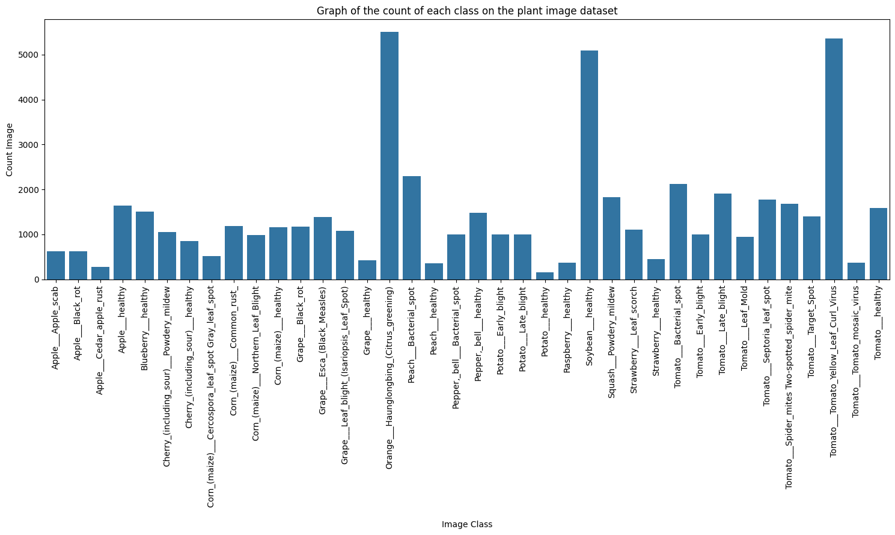
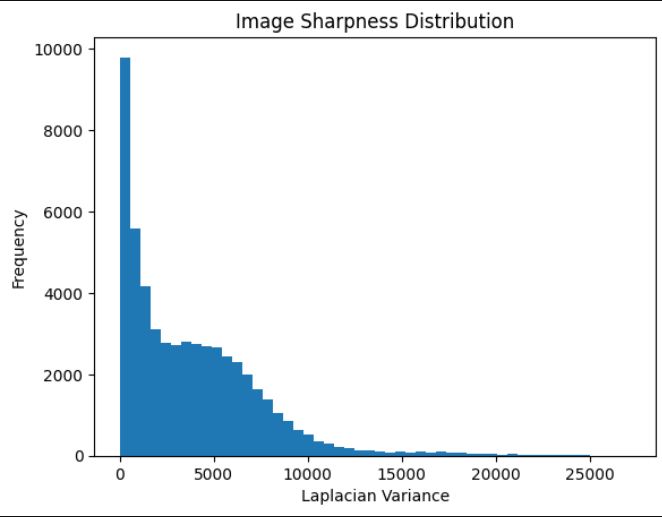

# Plant Disease Classification Analysis

This project analyzes a dataset of plant leaf images to classify various species and disease conditions. The workflow progresses from Exploratory Data Analysis (EDA) to implementing Convolutional Neural Networks and Transfer Learning.

## Exploratory Data Analysis

We analyzed the dataset to understand class distributions and image quality before training. The dataset is divided into three categories: Color, Grayscale, and Segmented.

### Class Distribution
The dataset contains 38 classes with a total distribution shown below. There is a significant class imbalance, with **Orange___Haunglongbing** having the most samples and **Potato___healthy** having the fewest.

**Top 5 Classes:**
- Orange___Haunglongbing_(Citrus_greening): 5507
- Tomato___Tomato_Yellow_Leaf_Curl_Virus: 5357
- Soybean___healthy: 5090
- Peach___Bacterial_spot: 2297
- Tomato___Bacterial_spot: 2127

**Bottom 5 Classes:**
- Raspberry___healthy: 371
- Peach___healthy: 360
- Apple___Cedar_apple_rust: 275
- Potato___healthy: 152

This imbalance (ratio of approx. 36:1) suggests the need for augmentation or class weighting to prevent bias towards the majority classes.

### Image Specifications
All images across the three folders (Color, Grayscale, Segmented) are standardized to the same dimensions.
- **Dimensions:** 256x256 pixels
- **Color:** 3 channels (RGB)
- **Grayscale:** 1 channel
- **Segmented:** 3 channels (masked background)

### Blur Detection (Laplacian Variance)
To filter out low-quality data, we calculated a blur score using the variance of the Laplacian. This method utilizes a kernel to approximate the second derivative of the image, where high variance corresponds to sharp edges and low variance corresponds to blurring.

The Laplacian $L$ of an image $I$ is calculated via convolution with a kernel $K$:

$$
L(x,y) = I(x,y) * K
$$

Where the kernel $K$ is typically:

$$
K = \begin{bmatrix} 
0 & 1 & 0 \\ 
1 & -4 & 1 \\ 
0 & 1 & 0 
\end{bmatrix}
$$

The sharpness score $S$ is the variance of the response:

$$S = \frac{1}{N} \sum_{i=1}^{N} (L_i - \mu_L)^2$$

### Blur Report
We computed the average sharpness scores for each dataset category.

**Dataset Statistics:**
- **Global Pixel Mean:** 0.52
- **Global Pixel Std:** 0.15

**Average Laplacian Variance (Sharpness):**
- **Color:** 2483.42
- **Grayscale:** 1825.19
- **Segmented:** 2875.98

The segmented images display the highest variance (2875.98) due to the high-contrast artificial edges created between the leaf and the black background. Grayscale images have the lowest variance (1825.19) as the conversion reduces the high-frequency information present in color channels.

## Shallow Models Baseline

To establish a baseline before deep learning, we evaluated three classical machine learning approaches.

**Random Forest Classifier (RFC)**
This model was used for its robustness to overfitting, employing an ensemble of decision trees to capture non-linear feature interactions without heavy tuning.

**SGD Classifier**
We tested a linear classifier optimized via stochastic gradient descent. This provided a computationally efficient benchmark for handling the high-dimensional flattened image data.

**Hierarchical Model**
We implemented a two-stage classification strategy. The model first predicts the plant species (e.g., Tomato vs. Corn) and subsequently classifies the specific disease within that species, effectively breaking the complex 38-class problem into smaller, manageable tasks.

## Model Architecture and Technical Strategy

This project implements a dual-stage deep learning pipeline: a custom CNN to learn feature extraction from raw pixels, followed by a transfer learning approach using ResNet18 to achieve state-of-the-art accuracy.

### Stage 1: Custom CNN (Feature Learning)
We engineered a custom Convolutional Neural Network (CNN) designed specifically for the 256x256 spatial dimensions of the dataset.

[Image of Convolutional Neural Network architecture diagram]

**Mathematical Formulation**
The core operation is the discrete convolution of an input image $I$ with a learnable kernel $K$:

$$(I * K)(i, j) = \sum_m \sum_n I(m, n) K(i-m, j-n)$$

This operation is followed by a non-linear activation (ReLU) and dimensionality reduction (MaxPooling).

**Architecture Specification**
The network is structured as a hierarchical feature extractor followed by a dense classifier.

| Layer Type | Filters / Units | Output Shape | Parameters | Function |
| :--- | :--- | :--- | :--- | :--- |
| **Input** | - | (3, 224, 224) | 0 | Raw RGB Tensor |
| **Conv2d** | 32 (3x3) | (32, 224, 224) | 896 | Edge/Gradient Detection |
| **MaxPool** | 2x2 | (32, 112, 112) | 0 | Spatial Reduction |
| **Conv2d** | 64 (3x3) | (64, 112, 112) | 18,496 | Shape/Contour Aggregation |
| **MaxPool** | 2x2 | (64, 56, 56) | 0 | Spatial Reduction |
| **Conv2d** | 128 (3x3) | (128, 56, 56) | 73,856 | Complex Texture Learning |
| **MaxPool** | 2x2 | (128, 28, 28) | 0 | Spatial Reduction |
| **Flatten** | - | 100,352 | 0 | Vectorization |
| **Dense** | 128 | 128 | 12,845,184 | Feature Compression |
| **Dropout** | p=0.5 | 128 | 0 | Regularization |
| **Output** | 38 | 38 | 4,902 | Class Probability Logits |

**Innovative Optimization**
To prevent the common "vanishing gradient" problem in training from scratch, we utilized **Batch Normalization** after each convolution. This normalizes the output distribution of the activation maps:

$$\hat{x}^{(k)} = \frac{x^{(k)} - \mu_B}{\sqrt{\sigma_B^2 + \epsilon}}$$

This ensures that the inputs to the next layer have a stable mean and variance, allowing for a higher learning rate ($\eta = 0.001$) and faster convergence.

### Stage 2: Transfer Learning (ResNet18)
To achieve **99.6% accuracy**, we utilized ResNet18. The superior performance is attributed to the **Residual Block** architecture, which solves the degradation problem in deep networks.

**The Residual Mechanism**
Instead of learning a direct mapping $H(x)$, ResNet learns the residual function $F(x) = H(x) - x$. The original mapping is reconstructed as:

$$H(x) = F(x) + x$$

This "skip connection" allows gradients to backpropagate through the identity path $x$ without attenuation, enabling the training of deeper feature extractors.

**Discriminative Fine-Tuning Strategy**
We replaced the final Fully Connected (FC) layer (512 -> 1000) with a domain-specific head (512 -> 38).

**Network Stats:**
- **Total Parameters:** ~11.7 Million
- **Backbone:** Frozen (initially) to preserve ImageNet feature detectors.
- **Head:** Trained to map high-level features (512-dimensional vectors) to plant disease classes.

**Why 99.6%? (The Feature Reuse Hypothesis)**
The high accuracy is not accidental. The lower layers of ResNet18 (trained on ImageNet) have already converged on optimal Gabor filters for detecting edges and textures. By initializing our model with these weights, we start optimization near the global minimum. We then use a low learning rate ($\eta = 1e-4$) to fine-tune the high-level filters to distinguish specific leaf textures (e.g., *Early Blight* concentric rings vs. *Late Blight* water-soaked spots).

### Innovative Augmentation (Geometric Invariance)
A critical component of our pipeline is **Dynamic On-the-Fly Augmentation**. Unlike static augmentation, transformations are applied probabilistically during the training loop.

**Mathematical Transformations**
For an input image vector $x$, we apply a transformation function $T_\theta(x)$ where $\theta$ is sampled from a distribution.

1. **Rotation Matrix ($R_\theta$):**

$$
\begin{bmatrix} x' \\ y' \end{bmatrix} = \begin{bmatrix} \cos\theta & -\sin\theta \\ \sin\theta & \cos\theta \end{bmatrix} \begin{bmatrix} x \\ y \end{bmatrix}
$$

   *Purpose:* Forces the model to learn rotation-invariant features (e.g., a spot is a spot regardless of orientation).
   
2.  **Horizontal Flip:**
    $$(x', y') = (-x, y)$$
    * *Purpose:* Eliminates directional bias from lighting conditions.

This strategy effectively creates an infinite dataset size ($N \to \infty$), as the probability of the model seeing the exact same tensor array twice approaches zero. This is the primary reason for the minimal gap between Training Accuracy (99.99%) and Validation Accuracy (99.62%).